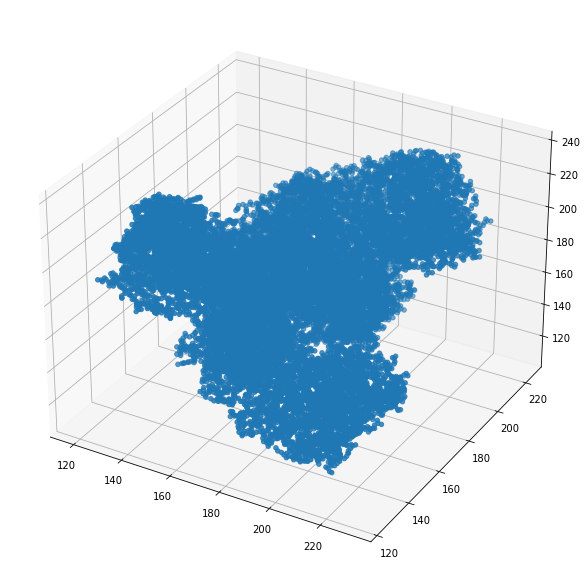

#  ProtGeom: Protein Geometric 

Python package for geometrical learning on protein structures.

## Install

To install this library, as is under development, we need to use testpipy index, it can be install with 
a simple command: 

```
pip install -i https://test.pypi.org/simple/ protgeom -U
```

## Examples


There is a helper to obtain a protein by name and parse the atomic structure
```python
mol_7q0b = fetchPDB('7Q0B')
mol_7q0b.num_atoms
```
    21148

Atom positons are read as 3D cordines into a cartesian plance with Å as unit. 

```python
mol_7q0b.cords
```
    array([[193.53 , 206.683, 173.089],
           [193.285, 208.002, 173.678],
           [194.431, 208.461, 174.578],
           ...,
           [210.995, 129.905, 137.104],
           [210.455, 128.536, 137.509],
           [209.865, 130.913, 136.954]])


Once the libary loaded the 3D structure we can easily work with the molecule vectors:

```python
import matplotlib.pyplot as plt
from mpl_toolkits.mplot3d import Axes3D
```


```python
fig = plt.figure()
fig.set_size_inches(18.5, 10.5)
ax = plt.axes(projection='3d')
ax.scatter3D(mol_7q0b.cords[:,0], mol_7q0b.cords[:,1], mol_7q0b.cords[:,2])
```


    
